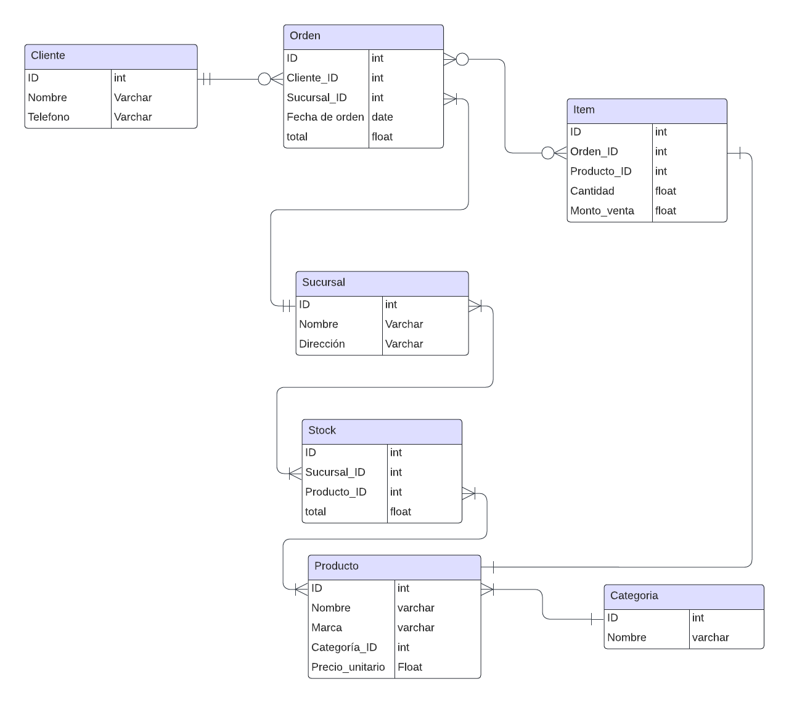

# Database-for-a-chain-store-Integration-project-ada-school

Este proyecto implementa un sistema integral de gestión de inventario y pedidos con **7 tablas interconectadas** diseñadas para manejar operaciones comerciales desde pedidos de clientes hasta seguimiento de inventario.

## Diagrama Entidad-Relación


## Descripción de Tablas

### **Cliente**
- **Campos:** ID (int), Nombre (varchar), Telefono (varchar)
- **Propósito:** Almacena información de clientes incluyendo detalles de contacto
- **Clave Primaria:** ID

### **Orden**
- **Campos:** ID (int), Cliente_ID (int), Sucursal_ID (int), Fecha de orden (date), total (float)
- **Propósito:** Gestiona pedidos de clientes con asignación de sucursal y totales de pedido
- **Clave Primaria:** ID
- **Claves Foráneas:** Cliente_ID, Sucursal_ID

### **Item**
- **Campos:** ID (int), Orden_ID (int), Producto_ID (int), Cantidad (float), Monto_venta (float)
- **Propósito:** Detalla artículos individuales dentro de los pedidos, incluyendo cantidades e importes de venta
- **Clave Primaria:** ID
- **Claves Foráneas:** Orden_ID, Producto_ID

### **Sucursal**
- **Campos:** ID (int), Nombre (varchar), Dirección (varchar)
- **Propósito:** Gestiona diferentes ubicaciones/sucursales del negocio
- **Clave Primaria:** ID

### **Stock**
- **Campos:** ID (int), Sucursal_ID (int), Producto_ID (int), total (float)
- **Propósito:** Rastrea niveles de inventario por producto en cada ubicación de sucursal
- **Clave Primaria:** ID
- **Claves Foráneas:** Sucursal_ID, Producto_ID

### **Producto**
- **Campos:** ID (int), Nombre (varchar), Marca (varchar), Categoria_ID (int), Precio_unitario (float)
- **Propósito:** Catálogo de productos con precios y categorización
- **Clave Primaria:** ID
- **Clave Foránea:** Categoria_ID

### **Categoria**
- **Campos:** ID (int), Nombre (varchar)
- **Propósito:** Sistema de categorización de productos
- **Clave Primaria:** ID

## Relaciones

- **Cliente → Orden** (1:N): Un cliente puede realizar múltiples pedidos
- **Sucursal → Orden** (1:N): Cada sucursal puede procesar múltiples pedidos
- **Orden → Item** (1:N): Un pedido puede contener múltiples artículos
- **Producto → Item** (1:N): Un producto puede aparecer en múltiples artículos de pedido
- **Sucursal → Stock** (1:N): Cada sucursal mantiene stock de múltiples productos
- **Producto → Stock** (1:N): Cada producto puede estar almacenado en múltiples sucursales
- **Categoria → Producto** (1:N): Una categoría puede contener múltiples productos

Este esquema soporta operaciones multi-sucursal con seguimiento integral de pedidos, gestión de inventario y capacidades de gestión de relaciones con clientes.

## Consultas SQL Útiles

### Análisis de Precios de Productos
Obtener precio mínimo, máximo y promedio de todos los productos:
```sql
SELECT nombre, 
       MAX(precio_unitario) AS "precio maximo", 
       MIN(precio_unitario) AS "precio minimo", 
       AVG(precio_unitario) AS "precio promedio"
FROM producto
GROUP BY nombre;
```

### Gestión de Inventario
Calcular cantidad total de productos en stock por sucursal:
```sql
SELECT sucursal_id, 
       SUM(total) AS "total productos stock"
FROM stock
GROUP BY sucursal_id
ORDER BY sucursal_id ASC;
```

### Análisis de Ventas por Cliente
Obtener total de ventas por cliente:
```sql
SELECT cliente_id, 
       SUM(total) AS "total ventas"
FROM orden
GROUP BY cliente_id
ORDER BY cliente_id ASC;
```

### Análisis por Categorías
Calcular precio promedio de productos en cada categoría:
```sql
SELECT c.nombre AS categoria, 
       AVG(p.precio_unitario) AS precio_promedio
FROM categoria c
INNER JOIN producto p ON c.id = p.categoria_id
GROUP BY c.nombre;
```

### Stock por Categoría
Obtener cantidad total de productos en stock por categoría:
```sql
SELECT c.nombre AS categoria, 
       SUM(s.total) AS total_en_stock
FROM categoria c
INNER JOIN producto p ON c.id = p.categoria_id
INNER JOIN stock s ON s.producto_id = p.id
GROUP BY c.nombre;
```

### Rendimiento por Sucursal
Calcular total de ventas por sucursal:
```sql
SELECT s.nombre AS sucursal, 
       SUM(o.total) AS ventas_totales
FROM orden o
INNER JOIN sucursal s ON o.sucursal_id = s.id
GROUP BY s.nombre
ORDER BY ventas_totales DESC;
```

### Análisis de Clientes Top
Obtener el cliente con mayor monto de compras:
```sql
SELECT c.nombre AS cliente, 
       SUM(o.total) AS monto_total
FROM orden o
INNER JOIN cliente c ON o.cliente_id = c.id
GROUP BY c.nombre
ORDER BY monto_total DESC;
```
